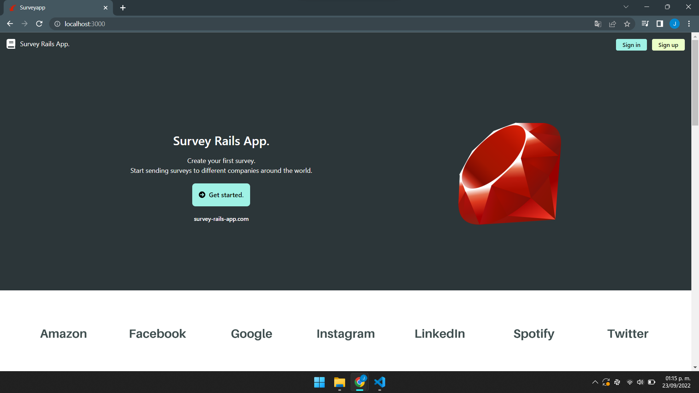
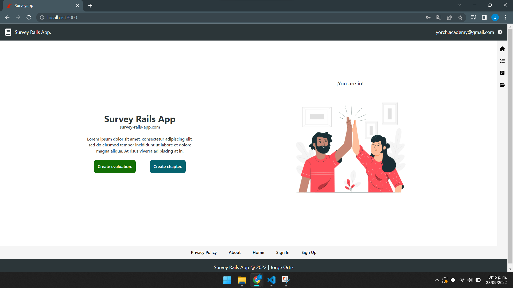
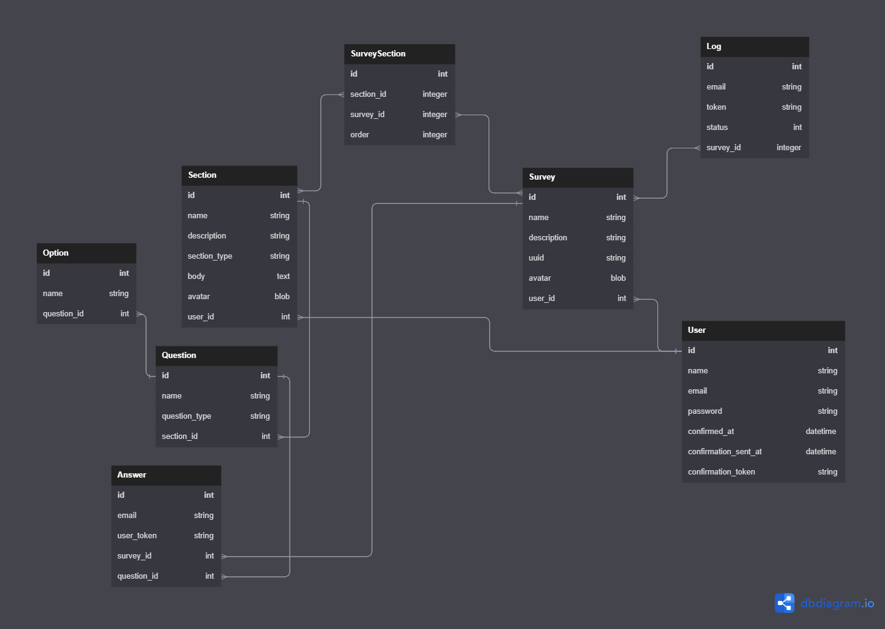

# Survey Rails App.

The Survey Rails App is a web application where users can create surveys and send them to other participants.
Participants will be able to answer this survey without being registered in the platorm. All updates within the application are being executed using Hotwire, Stimulus JS and Turbo-Streams.

## Clone Project.

In order to have a copy of this web application, follow the next instructions:

1. Be sure to have Docker install in your local computer.

2. If you are using docker in your desktop, open the application. If your using WSL, run the next command: `sudo service docker start`

2. Clone the repo: `git clone https://github.com/Jorge-Ortiz-Mata/Survey-Rails-App.git`

3. Add the .env file in the root with your Sendgrid Api Key.

4. Open a new terminal in the project and run the next command: `docker compose build`.

5. Run: `docker compose up`

6. Once the container is online, run: `docker compose run web rails assets:precompile`.

7. If it's not working, run: `docker compose run web rails tailwindcss:install`

8. And run: `docker compose run web rails tailwindcss:build`

9. Enjoy!

## Images.

This is the root_path if user is not registered.

Once the user is registered, the root_path changed.

## Database.

In this section, you will find the DB schema developed in this project.

## Features.

* Users can register in the platform.
* Users can create Surveys, Evaluations and Chapters.
* Surveys can be shared by email.
* Survey results can be downloaded in CSV Format.
* All updates are being made with Hotwire (no reload needed).
* Users can share surveys by email.
* Participants can answer the survey without being registered in the platform.
* Users can see participants' progress.

## Glosary.

* Evaluations. An evaluation contains questions and options.
* Chaperts. A chapter contains information to explain what the evaluation is about.
* Surveys. A survey contains evaluations and chapters.
## Services.

* Sendgrid. This web application uses Sendgrid in order to send emails. https://sendgrid.com/

## Software and versions.

* VS Code.
* WSL.
* Docker 20.18
* Ruby 3.0.4
* Ruby on Rails 7
* Hotwire, Stimulus JS and Turbo-Stream.
* TailwindCSS
* Sendgrid.
* PostgreSQL.

## Author

* Jorge Ortiz.
* yorch.academy@gmail.com
* LinkedIn profile: https://www.linkedin.com/in/jorge-ortiz-ab1b18183/

